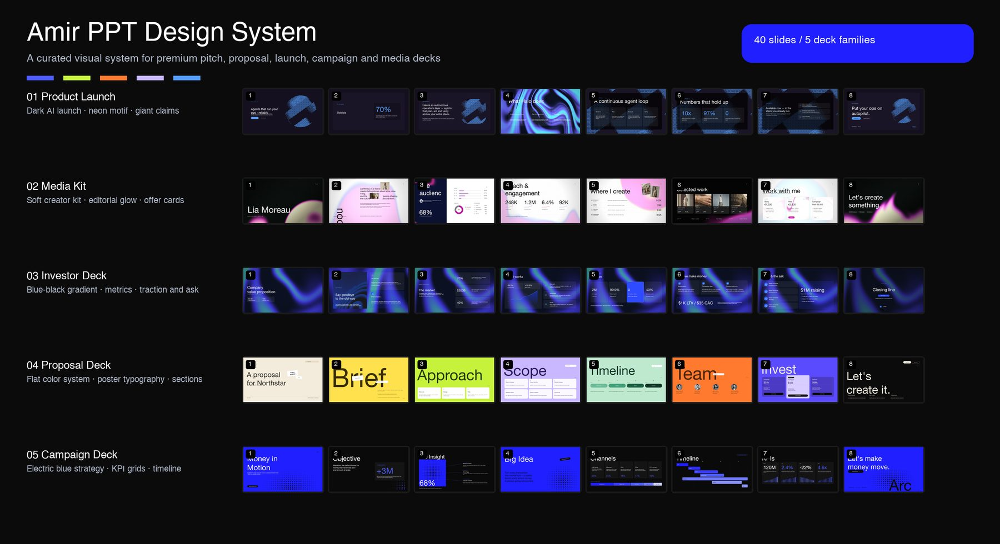

# Amir PPT Design System / Amir PPT 设计系统



> A curated presentation-design system distilled from 40 slides across five deck families: product launch, media kit, investor deck, proposal deck, and campaign deck.  
> 这是一套从 5 类 PPT、共 40 页中整理出来的演示设计系统，覆盖产品发布、媒体资料包、投资者关系、提案和 campaign deck。

## What Makes It Special / 精彩设计看点

**English**  
This style does not feel like a normal PowerPoint template. It feels closer to editorial art direction: giant typography, bold page rhythm, cinematic color, and commercial storytelling compressed into clean, memorable slides.

**中文**  
这套风格不像普通 PPT 模板，更像“杂志编辑设计 + 商业提案叙事”。它用超大标题、强烈色彩节奏、电影感背景和极简信息块，把商业内容做成一眼有记忆点的视觉作品。

## 5 Deck Families / 5 组设计范式

| Family | 中文说明 | Design Signature |
| --- | --- | --- |
| Product Launch | 产品发布 | Dark AI launch style: black-purple canvas, neon blue motif, huge claims, agent workflow cards |
| Media Kit | 媒体资料包 | Soft creator style: pastel glow, editorial serif/sans pairing, portfolio thumbnails, offer cards |
| Investor Deck | 投资者关系 | Blue-black investor narrative: traction metrics, market proof, business model, funding ask |
| Proposal Deck | 提案专用 | Bright editorial proposal: one vivid flat color per slide, poster-scale typography, compact sections |
| Campaign Deck | 项目提案 | Electric strategy deck: black and blue contrast, KPI grids, timelines, punchy closing line |

## Core Design DNA / 核心设计基因

### 1. Headline as the Composition / 标题就是画面主体

**English**  
The title is not just a label. It is the visual anchor. Titles often occupy 30-60% of the slide and can reach poster scale.

**中文**  
标题不是普通页标题，而是整页的视觉主体。很多页面的标题占据 30-60% 的画面，像海报一样先抓住注意力。

### 2. Tiny Navigation, Huge Impact / 小导航，大冲击

**English**  
A tiny section label, usually top-left, creates structure without weakening the hero message.

**中文**  
左上角常用很小的章节编号，例如 `04 · CHANNEL MIX`，既有结构感，又不会抢走主标题的注意力。

### 3. One Motif per Deck / 每套只坚持一个视觉母题

**English**  
Each deck repeats one recognizable motif: neon ribbons, dot matrices, blurred glow, flat color blocks, or oversized cropped type.

**中文**  
每套 PPT 都有一个贯穿始终的视觉母题：霓虹流体、点阵纹理、柔光渐变、纯色块、或巨大裁切文字。

### 4. Sparse-Dense Rhythm / 疏密节奏

**English**  
The deck alternates sparse statement slides with denser proof slides. This keeps the audience awake and gives every key idea room to land.

**中文**  
页面节奏会在“极简观点页”和“信息证明页”之间切换，让观众不会被信息淹没，也让重点内容更容易被记住。

## Three Visual Routes / 三条视觉路线

### Dark-Tech / 暗色科技路线

Best for AI, SaaS, fintech, investor decks, product launches, and strategy decks.  
适合 AI、SaaS、金融科技、投资人路演、产品发布和策略型提案。

- Base colors: `#0A0A0A`, `#14101F`, `#0B0B0B`
- Accents: `#4D5BFF`, `#549EFF`, `#4FA8FF`
- Visuals: neon ribbons, glass panels, blue metrics, dot matrices
- Mood: premium, intelligent, cinematic, technical

### Bold-Proposal / 高饱和提案路线

Best for agency proposals, creative briefs, commercial plans, and campaign pitches.  
适合创意提案、商业计划、agency pitch、campaign deck。

- Backgrounds: cream, yellow, lime, lavender, mint, orange, violet, black
- Typography: giant words such as `Brief`, `Approach`, `Scope`, `Timeline`
- Layout: one major idea per slide, small tags, low horizontal content blocks
- Mood: energetic, editorial, confident, easy to scan

### Soft-Media / 柔光媒体路线

Best for media kits, creators, portfolios, brand partnership decks, and lifestyle products.  
适合媒体资料包、达人介绍、作品集、品牌合作方案和生活方式产品。

- Backgrounds: white, black, off-white
- Accents: pink glow, cyan glow, pastel gradients
- Layout: large name/title, elegant metrics, portfolio thumbnails, package cards
- Mood: refined, personal, stylish, brand-friendly

## Recommended 8-Slide Structure / 推荐 8 页结构

1. Cover / 封面：一句强主张 + 视觉母题  
2. Objective or Problem / 目标或问题：明确为什么要看这份 deck  
3. Insight or Market / 洞察或市场：用一个大数字或观点建立必要性  
4. Big Idea or Mechanism / 核心方案：解释方案如何成立  
5. Channels or Workflow / 渠道或流程：把执行路径可视化  
6. Timeline or Business Model / 时间线或商业模式：让计划变得可信  
7. KPIs, Team, or Ask / 指标、团队或预算：给出判断依据  
8. Closing Line / 收尾主张：用一句行动型语言结束，而不是普通 “Thank you”

## Typography and Layout / 字体与版式

| Element | Recommended Scale | 中文说明 |
| --- | --- | --- |
| Section label | 14-18pt | 小章节标签，通常放左上角 |
| Body copy | 16-24pt | 正文尽量短，不做大段文字 |
| Card heading | 20-30pt | 信息块标题，辅助主视觉 |
| Slide title | 72-120pt | 常规强标题 |
| Poster title | 140-180pt | 海报级标题 |
| Hero metric | 90-180pt | 关键数字要敢于放大 |

Recommended fonts: Geist, Inter, DM Sans, Space Grotesk, Fraunces.  
推荐字体：Geist、Inter、DM Sans、Space Grotesk、Fraunces。

## How to Use This Skill / 如何使用这个 Skill

Use the skill folder in this repo:

```text
amir-ppt-style/
├── SKILL.md
├── agents/openai.yaml
└── references/style-system.md
```

Example prompts:

- "Create an investor deck in the Amir PPT style."
- "Restyle this proposal using the bold-proposal route."
- "Make a media kit with the soft-media glow style."
- "用 Amir PPT 风格帮我做一份产品发布 deck。"
- "把这份提案改成高饱和 editorial proposal 风格。"

## Design Checklist / 设计检查清单

- Is there one dominant visual object on each slide? / 每页是否只有一个最主要视觉对象？
- Is the title big enough to feel intentional? / 标题是否足够大，像设计而不是放大文字？
- Does the deck repeat one clear motif? / 整套是否有一个持续出现的视觉母题？
- Are cards secondary to the headline? / 信息卡片是否服务于标题，而不是抢戏？
- Is the copy short enough to scan quickly? / 文案是否短到可以快速扫读？
- Does the deck alternate sparse and dense slides? / 页面是否有疏密变化？
- Does the final slide end with a strong action line? / 结尾是否是一句强行动语，而不是普通感谢页？
